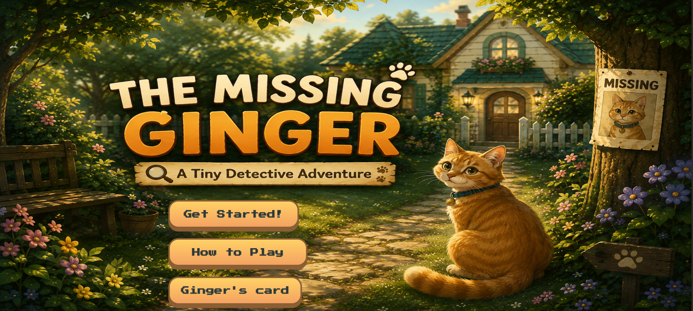
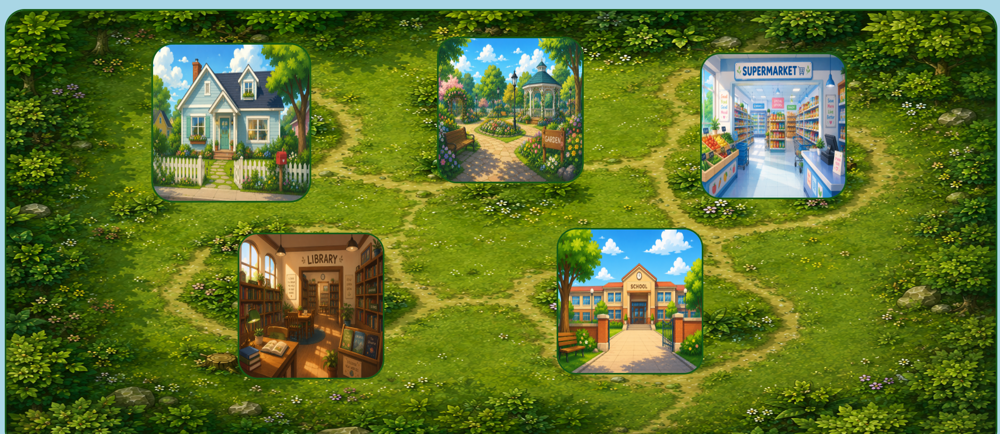
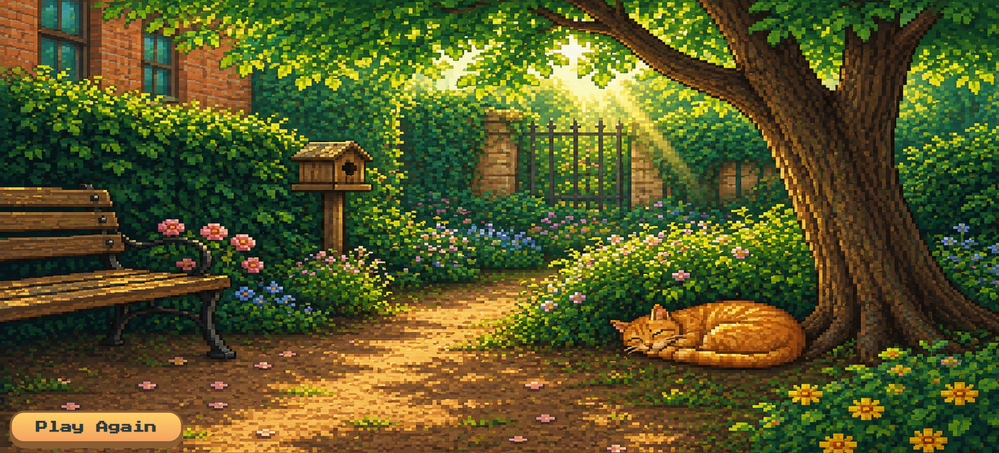

# Lost but Not Alone

## About the Game
Lost but Not Alone is a game where players try to find a missing cat called Ginger by discovering locations, collecting clues, and following them until they uncover Ginger's trail and solve the mystery.

## Why I Made It
Because I really like mystery games and collecting clues and noticing them, I asked myself, what if I made my own game
with the features and style I want? Then I challenged myself and started working on it until I finished Lost but not Alone. I really like this game as my first one.

## How to Play
1- First, you can see instructions for the game and information about ginger on the first page.
2- By clicking Start, you will find a map that shows locations.
3- Start searching every location carefully and finding clues by clicking them.
4- Each clue helps you figure out where to go next.
5- Finally, after following the clues, you will find Ginger.
6- Enjoy!

## Features
- Exploring different locations around the city.
- Discovering hidden clues.
- Interact with objects around the map.
- Get hints and messages.
- Navigate between locations.
- Sound effects for different interactions.
- Find Ginger and solve the mystery.

## Built With
- HTML
- CSS
- JavaScript

## Demo
[https://jana-yasser.github.io/Lost-but-not-Alone/](https://jana-yasser.github.io/Lost-but-not-Alone/)

## Gameplay
A short video about hot to play
[ watch the video](video.mp4)

## Screenshots
Start Screen

 Map

 Ending

## Challenges & What I Learned
1- JavaScript errors, but I learned how to follow the code, find errors, and avoid them in the future.
2- Finding sound resources, but I found one after searching.
3- Finding the style that matches me, so I mixed the styles I like.
4- Uploading the project to GitHub; it was really hard as my first time, but I could do it.

## AI Disclosure
- I used AI to generate pictures, as I had customized pictures that show specific things like clues, so it
  was the best way to do that without wasting much time and effort.
- I used it to explain how to do some features that I didn't know, especially JavaScript and its errors.

## Credits

Pixabay ([https://share.google/AJexHLT8oV6xgahDX](https://share.google/AJexHLT8oV6xgahDX)) for sounds.
ChatGPT ([https://chatgpt.com/](https://chatgpt.com/)) for generating pictures.
Google  ([https://share.google/bycLKMpUa7cVB0XBo](https://share.google/bycLKMpUa7cVB0XBo)) for fonts

ها
[مصادر الـ fonts / sounds / assets لو فيه]
